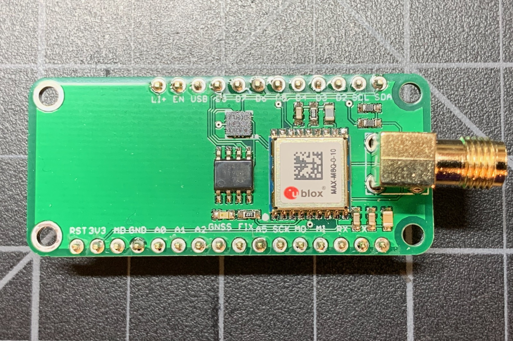
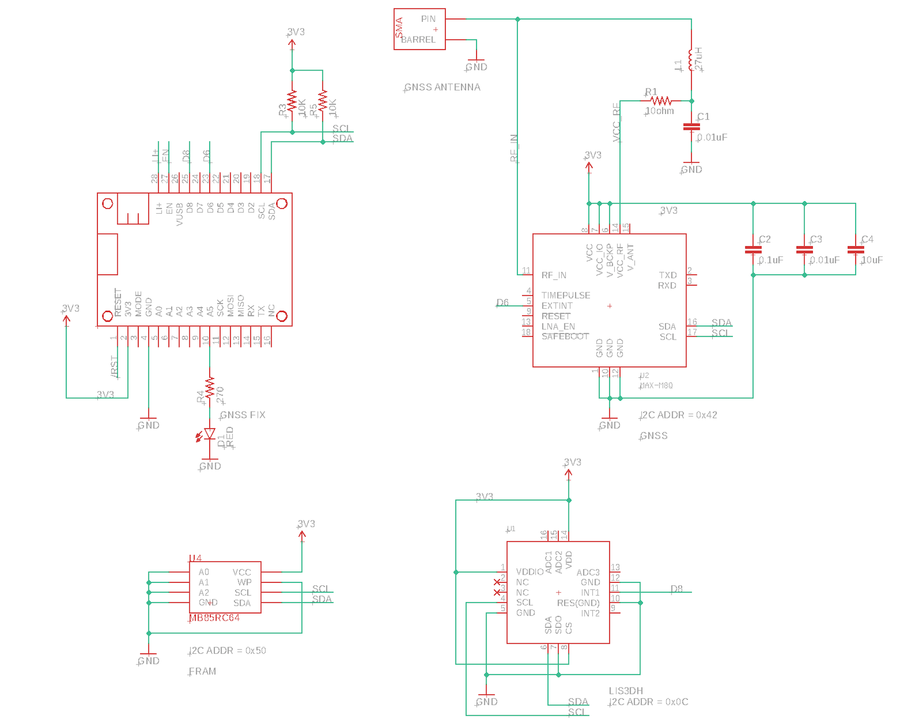
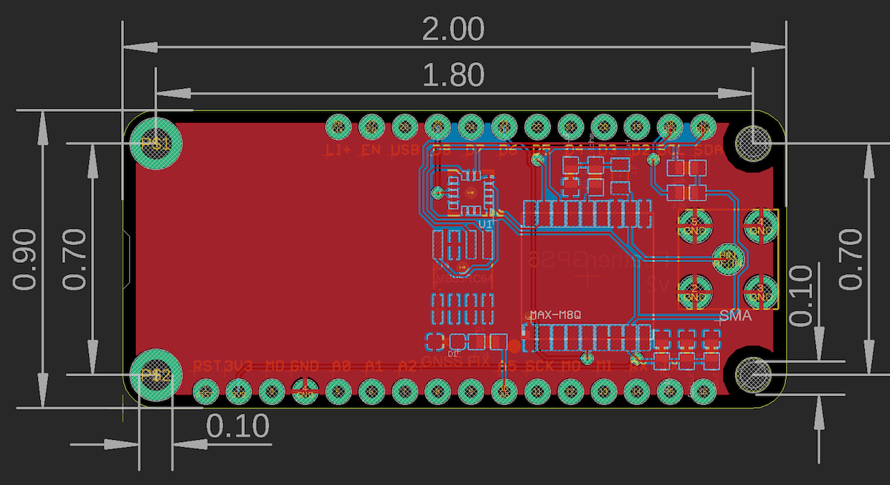

# FeatherGPS6

**Feather with u-blox M8 GNSS for Particle Boron and Argon**




## Hardware


### Schematic and Board Layout





### BoM (Bill of Materials)

| Quantity | Part | Description | Example | Cost | 
| :---: | :--- | :--- | :--- | ---: | 
| 2 | C1, C3 | CAP CER 0.01UF 100V X7R 0603 | [Murata GCM188R72A103KA37J](https://www.digikey.com/product-detail/en/murata-electronics-north-america/GCM188R72A103KA37J/490-8028-1-ND/4380313) | |
| 1 | C2 | CAP CER 0.1UF 25V X7R 0603 | [Samsung CL10B104KA8NNNC](https://www.digikey.com/product-detail/en/samsung-electro-mechanics/CL10B104KA8NNNC/1276-1006-1-ND/3889092) | | 
| 1 | C4 | CAP CER 10UF 16V X5R 0805 | [Murata GRM21BR61C106KE15L](https://www.digikey.com/product-detail/en/murata-electronics-north-america/GRM21BR61C106KE15L/490-3886-1-ND/965928) | |
| 1 | D1 | LED RED CLEAR 0603 SMD | [Lite-On C193KRKT](https://www.digikey.com/product-detail/en/lite-on-inc/LTST-C193KRKT-5A/160-1830-1-ND/2356251) | $0.41 |
| 1 | J1 | CONN SMA JACK R/A 50 OHM PCB | [TE 5-1814400-1](https://www.digikey.com/product-detail/en/te-connectivity-amp-connectors/5-1814400-1/A97593-ND/1755981) | $2.82 |
| 1 | L1 | FIXED IND 27UH 5MA 1 OHM SMD  | [TDK Corporation MLF2012C270KT000](https://www.digikey.com/product-detail/en/tdk-corporation/MLF2012C270KT000/445-1064-1-ND/504462) | $0.18 | 
| 1 | R1 | RES SMD 10 OHM 5% 1/10W 0603 | [Panasonic ERJ-3GEYJ100V](https://www.digikey.com/product-detail/en/panasonic-electronic-components/ERJ-3GEYJ100V/P10GCT-ND/62816) | | 
| 2 | R3, R5 | RES SMD 10K OHM 5% 1/4W 0603 | [Panasonic ERJ-PA3J103V](https://www.digikey.com/product-detail/en/panasonic-electronic-components/ERJ-PA3J103V/P10KBZCT-ND/5036237) | | 
| 1 | R4 | RES SMD 270 OHM 5% 1/10W 0603 | [Panasonic ERJ-3GEYJ271V](https://www.digikey.com/product-detail/en/panasonic-electronic-components/ERJ-3GEYJ271V/P270GCT-ND/134766) | | 
| 1 | U1 | ACCEL 2-16G I2C/SPI 16LGA | [LIS3DHTR](https://www.digikey.com/product-detail/en/stmicroelectronics/LIS3DHTR/497-10613-1-ND/2334355) | $1.53 |
| 1 | U2 | RF RCVR GNSS/GPS 1.575GHZ 18LCC | [u-blox MAX-M8Q-0](https://www.digikey.com/product-detail/en/u-blox-america-inc/MAX-M8Q-0/672-1003-1-ND/6150666) | $21.00 |
| 1 | U3 | IC FRAM 64K I2C 3.4MHZ 8SOP | [Fujitsu MB85RC64TAPNF-G-BDERE1](https://www.digikey.com/product-detail/en/fujitsu-electronics-america-inc/MB85RC64TAPNF-G-BDERE1/865-1274-1-ND/6802280) | $1.58 |
|   |    | Male Header Pins (0.1") | [Sullins PRPC040SAAN-RC](https://www.digikey.com/product-detail/en/PRPC040SAAN-RC/S1011EC-40-ND/2775214) | |

### Differences from Electron AssetTracker V2

While both this board and the Electron AssetTracker V2 have a u-blox MAX M8 GNSS, there are some notable differences:

- There is no built-in GNSS antenna, there is only a SMA connector for an external active antenna.
- The u-blox GNSS is connected by I2C in this board instead of UART serial. Since there is only one hardware serial port available on the Boron and Argon, using I2C frees up ports as I2C can be shared by many peripherals.
- The LIS3DH is connected by I2C instead of SPI. Using I2C frees up the SPI pins and a CS pin.
- This board contains an optional FRAM, ferro-electric non-volatile RAM. You don't need to populate this, but it's handy if you want to store some data that requires more permanence than retained memory but needs to be able to read and written frequently, where flash were would be an issue.
- There is no u-blox GNSS power control MOSFET. The GNSS has a large inrush of current when you power it on, and this will brown out a Boron or Argon and cause the MCU to reset. Instead, the GNSS is powered down in software.
- The LED is not driven by the GNSS TIMEPULSE pin, it's connected to a MCU GPIO (A5). This allows for a more useful status display.

| | Electron AssetTracker V2 LED | FeatherGPS6 LED |
| :--- | :---: | :---: |
| GNSS Off | Off | Off | 
| Scanning for satellites (<= 3 found) | Off | Slow Blink |
| Scanning for satellites (> 3 found) | Off | Fast Blink |
| GNSS lock | Blink | On | 

- The other issues with TIMEPULSE are that it start blinking when GNSS time is locked, which can occur at 4 satellites, before location lock is achieved. This is confusing. Also, when in software power-down, TIMEPULSE is pulled high with a weak pull-up in the GNSS, which causes the LED to be lit dimly when in powerdown mode, which unnecessarily uses power.

## Example Firmware

Full test code source:

```cpp

#include "AssetTrackerRK.h"

SYSTEM_THREAD(ENABLED);

SYSTEM_MODE(SEMI_AUTOMATIC);

SerialLogHandler logHandler;

void checkGnss(); // forward declaration
void buttonHandler(system_event_t event, int param);

const unsigned long PUBLISH_PERIOD = 120000;
const unsigned long SERIAL_PERIOD = 5000;
const unsigned long CHECK_PERIOD = 100;

AssetTrackerFeather6 t;
unsigned long lastCheck = 0;
unsigned long lastSerial = 0;
unsigned long lastPublish = 0;
unsigned long startFix = 0;
bool gettingFix = false;
bool doSleep = false;

void setup()
{
	// When the MODE button is pressed, the device will go to sleep for 
	// 60 seconds.
	System.on(button_final_click, buttonHandler);

	// Optional: Enable this to wait for USB serial to connect so you can
	// see all of the log messages at startup.
	waitFor(Serial.isConnected, 10000);

	// Be sure to call Tracker setup from setup!
	t.setup();

    startFix = millis();
    gettingFix = true;

	Particle.connect();
}

void loop()
{
	// Be sure to call Tracker loop from loop. 
    t.loop();

	checkGnss();

	if (doSleep) {
		doSleep = false;

		Log.info("going to sleep");

		// Put the GPS to sleep
		t.gnssSleep();

		// Put the system to sleep
		SystemSleepConfiguration config;
		config.mode(SystemSleepMode::ULTRA_LOW_POWER)
			.duration(60s);

		System.sleep(config);

		waitFor(Serial.isConnected, 10000);

		Log.info("woke from sleep");

		// Restart the connecting to GNSS timer
		lastSerial = 0;

		// Wake the GPS again
		t.gnssWake();

	}
}

void checkGnss()
{
	if (millis() - lastCheck < CHECK_PERIOD) {
		return;
	}
	lastCheck = millis();

	// Check the GNSS 10 times per second (100 milliseconds)

	char buf[128];
	bool fixStatusChange = false;

	if (t.gpsFix()) {
		snprintf(buf, sizeof(buf), "location:%f,%f altitude:%f satellites:%d hdop:%d", t.readLatDeg(), t.readLonDeg(), t.getAltitude(), t.getSatellites(), t.getTinyGPSPlus()->getHDOP().value());
		if (gettingFix) {
			gettingFix = false;
			fixStatusChange = true;
			unsigned long elapsed = millis() - startFix;
			Log.info("%lu milliseconds to get GPS fix", elapsed);
		}
	}
	else {
		snprintf(buf, sizeof(buf), "no location satellites:%d", t.getSatellites());
		if (!gettingFix) {
			gettingFix = true;
			fixStatusChange = true;
			startFix = millis();
		}
	}

	if (millis() - lastSerial >= SERIAL_PERIOD || fixStatusChange) {
		lastSerial = millis();
		Log.info(buf);
	}

	// Publish to the cloud
	if (Particle.connected()) {
		if (millis() - lastPublish >= PUBLISH_PERIOD) {
			lastPublish = millis();
			Particle.publish("gps", buf, PRIVATE);
		}
	}

}


void buttonHandler(system_event_t event, int param) {
	// int clicks = system_button_clicks(param);

	doSleep = true;
}
```


### Details

This library uses the [**AssetTrackerRK**](https://github.com/rickkas7/AssetTrackerRK) library for managing the GNSS. It also includes the [**LIS3DH**](https://github.com/rickkas7/LIS3DH) library for using the LIS3DH accelerometer.

To test the sleep mode, tap the MODE button. The device will go into ULTRA_LOW_POWER mode for 60 seconds then reconnect. You should be able to reconnect to the GNSS in around 3 seconds because the ephemeris and almanac data should still be valid.

